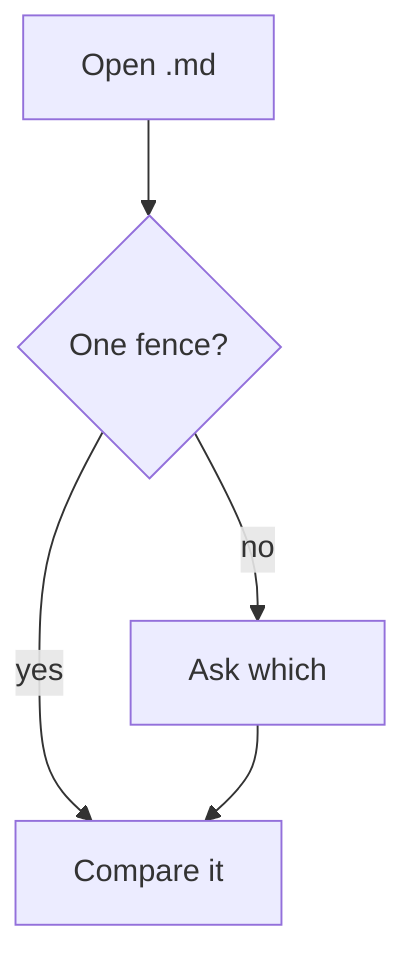

# ADR 1: Read diagrams from Markdown

## Status

Accepted.

## Context

Most Mermaid lives in Markdown rather than in `.mmd` files, and a fenced diagram is exactly the
kind of change a text diff renders unreadable.

## Decision

