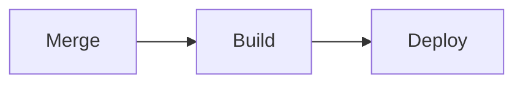
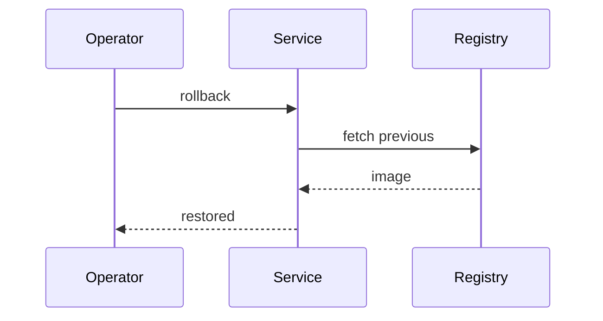

# Release notes

A Markdown file with more than one diagram, for trying the fence picker.

## Deploy


```mermaid
flowchart LR
    A[Merge] --> B[Build]
    B --> C[Deploy]
```

## Rollback


```mermaid
sequenceDiagram
    Operator->>Service: rollback
    Service->>Registry: fetch previous
    Registry-->>Service: image
    Service-->>Operator: restored
```

Fences in other languages are ignored:

```ts
const notADiagram = true;
```
